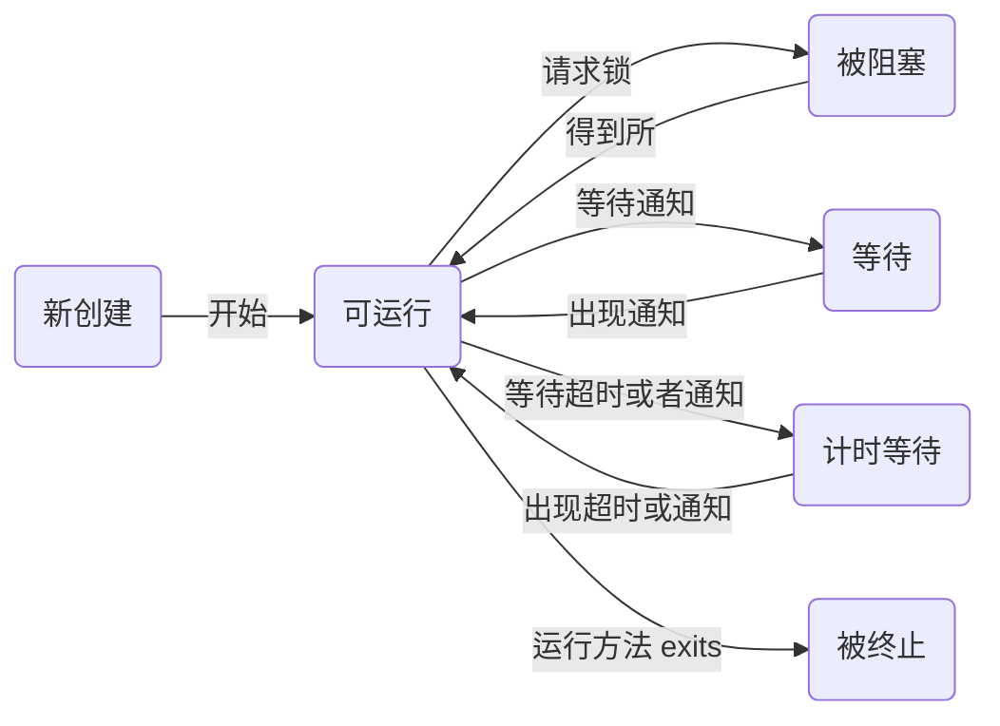

##### 14.2 中断线程

* 默认终止条件：
	* run 方法执行到最后一条语句

* 强制中断线程：
	* interrupt 方法
当对一个线程调用了 interrupt 方法时，线程的中断状态将被置位，每个线程都应该不断地检查这个标志，使用静态的 Thread.currentThread 方法获得当前线程，然后调用 isInterrupted method 方法。
```java
	while(!Thread.currentThread().isInterrupted && more work to do){
    	do more work;
    }
```

##### 14.3 线程状态

* New 新创建
* Runnable 可运行
* Blocked 被阻塞
* Waiting 等待
* Timed waiting 计时等待
* Terminated 被终止
	可以使用 getState 方法来获得当前线程的状态

* 被阻塞线程和等待线程
	* 相同点：线程处于二者状态时，均不活动，不运行任何代码，并且消耗最少的资源。
	* 不同点：如何到达非活动状态
		* 被阻塞线程，主动请求获得一个内部的对象锁时，而该锁为其他线程持有，该线程进入阻塞状态
		* 等待线程，线程等待另一个线程通知调度器一个条件时，自己进入等待状态。
			* 计时等待，这个状态将一直保持到超时期或者接收到适当的通知。


##### 14.4 线程属性

* 线程优先级
	* 使用 setPriority 方法提高或者降低线程的优先级。从 MIN_PRIORITY 到 MAX_PRIORITY 共 1 到 10 级。常规 NORM_PRIORITY 5.
	* 策略：线程调度器每次只选具有较高优先级的线程，即使低优先级的线程从来没有运行过，会造成饥饿现象，应该尽力避免（如何避免呢？？）
	```java
    static void yield() // 当前线程让步，如果其他可运行的线程具有与此线程相同优先级的，会被调度。
    ```
* 守护线程
	* 作用：主要为其他线程提供服务。例如计时线程。
	* 注意：当只剩下守护线程时，虚拟机就退出了，所以不要在守护线程中访问固有资源，比如文件，数据库等，因为其会在任何时候发生中断。
	```java
    标识该线程为守护线程或者用户线程，在线程启动之前调用。
	```

* 未捕获异常处理器
	线程的 run 方法不能抛出任何被检测的异常，不被检测的异常会导致线程终止。实际上，在线程死亡之前，已经将异常传递到了用于未捕获异常的处理器。
    * 具体处理，处理器实现一个 Thread.UncaughtExceptionHandler 接口的类。实现其唯一方法
	```java
        void uncaughtException(Thread t,Throwable e)// 使用 setUncaughtExceptionHandler方法为任何线程安装处理器
	```
    * 默认处理器，可以使用
	```java
        setDefaultUncaughtExceptionHandler 为所有线程安装一个默认的处理器，替换处理器可使用日志 api 发送未捕捉异常的报告到日志中。
	```
    * 不安装默认处理器
    	默认的处理器为空，不为独立的线程安装处理器，此时的处理器就是该线程的 ThreadGroup 对象。

##### 14.5 同步

* 资源，竞争，出错
	为了将一系列操作封装成原子操作，使其不可被打断，java 提供了两种方式，其一为 synchronized关键字，synchronized关键字自动提供一个锁和相关条件，其二为 ReentrantLock 保护代码块。

* 锁对象
    ```java
    Lock myLock = new ReentrantLock(); // 如果使用 ReentrantLock(boolean fair)，将生成一个公平锁，但是此锁的性能很低。
    myLock.lock();
    try{
    some operations;
    }
    finally
    {
     myLock.unlock(); // 这一结构确保任何时刻都只有一个线程进入临界区，其他线程会被阻塞。因为这个特点，unlock一定要放在 finally，否则其他线程将永远被阻塞
     // 每个调用 try 中语句的代码将串行执行
    }
    ```
    如果使用锁，就不能使用带资源的 try 语句？

* 条件对象
	* 出现的原因：
		当线程借助锁，进入了临界区，却发现在某一条件满足之后，它才能执行。但是此时它已经将资源锁定，其他线程被阻塞，无法得到这些资源，因而无法运行。故需要使用一个条件来管理那些已经获得了一个锁但是不能做有用工作的线程，让其将资源让给其他线程。
    * 实现方式：
    ```java
        private Condition sufficientFunds;
        sufficientFunds = bankLock.newCondition();
        // 当发现条件不满足时，调用
        sufficientFunds.await();
        // 当其他线程操作之后，上面条件可能被满足的时候，调用下面方法，让所有那些阻塞的线程重新测试条件
        sufficientFunds.signalAll();
        // 如果没有线程调用上面函数，那么所有正在等待的线程会一直被阻塞，出现饥饿现象，最终被挂起。
        // 当然还可以调用 signal 函数，随机选择一个正在等待线程测试条件，该函数具有一定的风险，即如果随机选的那个不能解除阻塞呢？
        sufficientFunds.singal();
	```
* 锁和条件的总结：
	* 锁可以用来保护代码片段，任何时刻只有一个线程执行被保护代码
	* 锁可以管理视图进入被保护代码段的线程
	* 锁可以拥有一个或多个相关的条件对象
	* 每个条件对象管理那些已经进入被保护的代码段但还不能运行的线程

* synchronized 关键字
	* 实现基础：
		java 语言内部的机制，从 1.0 开始，java 中的每个对象都有一个内部锁，如果对一个方法用 synchronized 关键字声明，那么该锁将保护整个方法中的代码
    * 特点：
    	内部锁只有一个相关条件，使用 wait 方法将一个线程添加到等待集中，使用 notifyAll 或者 notify 解除线程阻塞状态。

* 内部锁和条件的局限
	* 不能中断一个正在尝试获得所的线程
	* 试图获得锁时不能设置超时限制的时间
	* 每个锁仅有单一的条件可能是不够的
* 建议：
	如果能够使用 synchronized 关键字，就尽量使用该关键字，如此能够减少代码量和出错数。

