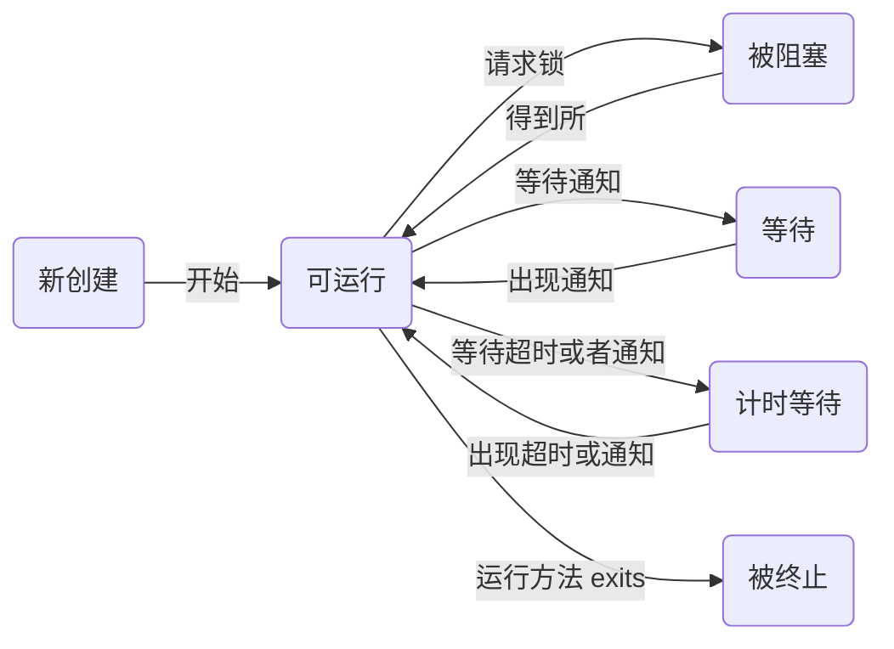

## 3 章 Java 的基本程序设计结构

##### 3.3 数据类型

* 整形
	|类型|存储需求|
    |----|------|
    |int| 4字节|
    |short| 2 字节|
    |long|8字节|
    |byte|1字节|

* 浮点型
	|类型|存储需求|
    |----|-----|
    |float|4字节|
    |double|8字节|

* 三种特殊的浮点数值
	* 正无穷大，Double.POSITIVE_INFINITY
	* 负无穷大，Double.NEGATIVE_INFINITY
	* 错误，NaN，使用 Double.isNan(x)来判断 x 是否是 NaN
* char 类型
	* 16 位，两个字节
	* char类型描述了 UTF-16 编码中的一个代码单元
	* 建议，编程中，最好将字符串作为抽象数据类型处理。

* boolean类型
	* 不能和整数值转换

##### 3.4 变量

* 尽管 $ 是合法 java 字符，但是不要在代码中使用，它只用在 java 编译器或其它工具生成的名字中。
* java 中可以将声明尽可能地靠近变量第一次使用的地方

##### 3.5 运算符
* Math.pow(x,y)， 幂运算
* 给出了两种取余的实现 Math.floorMode(12,-5) = 3，而 12%-5 = -2
* 数值转换
	* 结果截断，比如(byte)300 的实际值是 44

* 位运算
	* & 是与运算，和 && 完全不同
	* << 和 >> 分别是左移运算和右移运算
	* \>>> 右移运算，使用 0 来填充高位

##### 3.6 字符串
* String 是不可变字符串，不是字符数组，如果需要修改这个字符串中的某一位置字符，要新建一个 String，使用拼接的方法来修改。
* 判断字符串是否相等，需要使用 equal, "==" 是判断两个变量的位置是否相同
	```java
    	String s1 = "hello";
		String s2 = "hello";
        //下面两个表达式都为 true，是因为 java 对字符串的存储做了优化
		System.out.println(s1 == s2); // true
		System.out.println(s1.equals(s2)); // true
        // 下面两个表达式的值不同，说明了问题
		System.out.println(s1.substring(3) == "lo");// false
		System.out.println(s1.substring(3).equals("lo")); // true
    ```
* 空串和 null
	* null  和 "" 不相同

* StringBuilder
	* 和 String 的区别
    	1. 每次想要添加一部分内容的时候，就用 append 方法即可。不必像 String 新建一个String 对象。
    	2. 能够在指定位置插入字符，字符串，能够删除字符，字符串
    	3. 使用 toString() 方法就能得到一个 String 对象

##### 3.7 输入输出
* 输入
	```java
    Scanner in = new Scanner(System.in);
	String str1 = in.nextLine(); // 读取整行，不忽略空格
    String str2 = in.next(); 	// 读取字符串，遇到空格会被截断，分两次读取
    Console cons = System.console();
    String str3 = cons.readPassword("pwd:"); // 可以不回显
    ```
* 格式化输出
	* System.out.printf() 沿用了 c 语言中的 printf 的格式化方法
	* String.format();   创建一个格式化了的字符串
* 文件输入和输出
就是重新定义流的输入源和流向
```java
	public static void main(String[] args) throws IOException {
		PrintWriter outFile = new PrintWriter("file.txt","UTF-8"); // 输出方向指向 file.txt
		outFile.println("Hello world!"); // 向 file.txt 写入 Hello world
		outFile.close();
		Scanner in = new Scanner(new File("file.txt"),"UTF-8"); // 输入来源为 file.txt
		System.out.println(in.nextLine()); // 从输入源中得到字符串
		in.close();
	}
```

##### 3.8 控制流程
* break 和 continue 跳转到标签，实现类似 goto 功能，标签可以放在任何语句块之前，但是不能跳入语句块中。
	* 可以用于在嵌套有多层循环时，从内层循环跳出最外层循环，如下所示
	```java
    public static void main(String[] args) {
		int i=0,j=0,k=0;
		outer:for(i = 0;i< 10;i++) {
			for(j = 0;j< 10;j++) {
				for(k = 0; k < 10;k++) {
					if(k == 5 && j == 5 && i == 5) {
						// 跳出了最外层循环
						// 而不必一层一层地跳出
						break outer;
					}
				}
			}
		}
		System.out.println("i:"+i+" j:" + j + " k:" + k);
		System.out.println("I have jump from the inner of 3 levels for");
	}
    ```
* switch 语句
	* case 没有 break 时，可能触发多个 case
	* case 标签后的变量可以是 char、byte、short 或 int 的常量表达式，或者是枚举常量，从 java7 之后可以是字符串字面量。

##### 大数值
* BigInteger
	* 需要使用方法来替代基本的算术运算
* BigDecimal

##### 数组
* 创建一个数组
```java
// 两种方式
int[] a = new int[100]; //看起来像是将 a 定义为 一个 int[] 型的变量，便于理解
int a[] = new int[100];
```

* foreach
```java
	for(变量类型 变量名: 集合){ }
```

* 常见的数组 api
	* 数组拷贝， 数组 = Arrays.copyOf(数组，length)
	* 拷贝一段数组，Arrays.copyOfRange(数组，int start, int end);
	* 数组排序, Arrays.sort(数组); // 就地排序
	* 数组查找, Arrays.binarySearch(数组， 元素)
	* 分范围查找, Arrays.binarySearch(数组，元素，int start, int end);
	* 全填充， Arrays.fill(数组，元素)，将数组全部填充成参数元素

* 多维数组
	* java 可以创建不规则数组，例如
	```java
    public static void main(String[] args) {
		// 创建多维不规则数组
		int[][] a = new int[10][]; // 需要指定第一个维度
		for (int i = 0; i < a.length; i++) {
			a[i] = new int[i + 1];
			for (int j = 0; j < i+1; j++) {
				a[i][j] = j+1;
			}
			ArrayTest.printArray(a[i]);
		}
	}
    ```
    输出
    ```java
    1	
    1	2	
    1	2	3	
    1	2	3	4	
    1	2	3	4	5	
    1	2	3	4	5	6	
    1	2	3	4	5	6	7	
    1	2	3	4	5	6	7	8	
    1	2	3	4	5	6	7	8	9	
    1	2	3	4	5	6	7	8	9	10
    ```

## 4 章 对象与类
* 封装的优点
	* 更改器可以执行错误检查，防止出错
	* 注意：不要返回引用可变对象的访问器方法，这样会破坏类成员的封装性，因为这意味着返回了一个引用
		* 如果想要返回一个可变数据域的拷贝，应该使用 clone

* 静态方法之于工厂方法
	* 使用静态工厂方法产生不同风格的格式对象

* 方法参数的使用情况
	* 方法不能修改基本数据类型的参数（数值型和布尔型）
	* 方法可以改变对象的状态，比如说改变对象的属性值
	* 方法不能让对象参数引用一个新的对象，即该对象引用本身的值不能被改变
* java 中的函数参数没有引用传递

* java 中可以显式域初始化，即定义类成员变量时赋值， c++ 中不能直接初始化类的实例域。

* 初始化模块


## 9 章 集合

##### 9.2 具体的集合

| 集合类型 | 描述 |
|--------|--------|
|    ArrayList    |   一种可以动态增长和缩减的索引序列     |
|	LinkedList	  | 	一种可以在任何位置进行高效地插入和删除操作的有序序列 |
|   Hashtable	  |  哈希表，同时保存键和值 |
|	ArrayDeque	  | 双端队列，可以从两端入队出队 |
|	Stack		| 栈 	|

* 链表

LinkedList 类，然后借助　Iterator 接口来实现元素的遍历
```java
List<String> staff = new LinkedList<String>();
staff.add("I am the first");
staff.add("I am the second");
// 返回 ListIterator，作为一个指针，来辅助访问 List 中的元素
ListIterator<String> iter = staff.iterator();
iter.add("zero");
// 已经将元素添加到了列表头部
String first = iter.next();
System.out.println(first);
// 现在迭代器指向 first，remove的时候，删除的也是 first
//		iter.remove();
String second = iter.next();
System.out.println(second);
// LinkedList 是一个双向链表，可以指向前一个元素
String pre = iter.previous();
System.out.println(pre);
for (String string : staff) {
	System.out.println(string);
}
String oldValue = iter.next();
iter.set(newValue); // 将 iter 指向的元素替换成一个新的值
// 使用 contain 方法判断是否存在某个元素
System.out.println(staff.contains("zero"));
// 使用 get(int i) 方法访问第 i 个元素，List 未做缓存，无优化，因此复杂度为 O(n)，应该谨慎使用
// 而使用 iter.next() 和 iter.previous() 方法效率很高，应为 iter 一直保持当前的计数
System.out.println(staff.get(0));
// 如果有一个整数索引 n，使用 listIterator(n).next()，会返回索引为 n 元素，同时指针下移
System.out.println(staff.listIterator(1).next());
// LinkedList 类的方法还有 addFirst(Object),addLast(Object)
// getFirst(),getLast(),removeFirst(),removeLast() 等方法
LinkedList<String> staffL = (LinkedList<String>)staff;
staffL.addFirst("-first");
staffL.addLast("I am three");
System.out.println(staffL.toString());
```

* 数组列表类

ArrayList 类实现了 List 接口，封装了一个动态再分配的对象数组。Vector 是与 ArrayList 类似的数据结构，并且实现了同步访问，但是同步需要消耗时间和资源，因此在不需要同步的时候，可以选择使用 ArrayList

* 散列集
	* 实现原理：
		* 计算对象的散列码
		* 散列码对桶的总数取余，根据余数放到对应的桶中
		* 如果桶中已有对象，比较对象是否相同，如果不相同，添加，如果相同，不添加
	* 再散列
		* 装填因子为 0.75 ：散列表中超过 75% 的位置已经填入了元素，表就会用双倍的桶数自动进行再散列

* set 类
	* set 类中是没有重复元素的元素集合

* HashSet 类
	* add 添加新元素
	* contains 快速在某个桶中查看元素是否已经存在

* 树集（TreeSet类）
	* 和 HashSet 的区别，TreeSet 顺序保存元素
	* 可以通过实现 Comparable 接口来控制顺序

* 队列和双端队列

* 优先队列

* 映射表
	```java
	Map<String, Employee> staff = new HashMap<String, Employee>();
	```

* 栈(Stack)
	* boolean empty()，测试栈是否为空
	* Object peek(), 查看栈顶的元素，但是不删除
	* Object pop(), 删除栈顶元素，并且删除
	* Object push(Object), 将元素压入栈中
	* int search(Object), 返回元素的位置


## 14 章 线程
##### 14.2 中断线程

* 默认终止条件：
	* run 方法执行到最后一条语句

* 强制中断线程：
	* interrupt 方法
当对一个线程调用了 interrupt 方法时，线程的中断状态将被置位，每个线程都应该不断地检查这个标志，使用静态的 Thread.currentThread 方法获得当前线程，然后调用 isInterrupted method 方法。
```java
	while(!Thread.currentThread().isInterrupted && more work to do){
    	do more work;
    }
```


##### 14.3 线程状态

* New 新创建
* Runnable 可运行
* Blocked 被阻塞
* Waiting 等待
* Timed waiting 计时等待
* Terminated 被终止
	可以使用 getState 方法来获得当前线程的状态

* 被阻塞线程和等待线程
	* 相同点：线程处于二者状态时，均不活动，不运行任何代码，并且消耗最少的资源。
	* 不同点：如何到达非活动状态
		* 被阻塞线程，主动请求获得一个内部的对象锁时，而该锁为其他线程持有，该线程进入阻塞状态
		* 等待线程，线程等待另一个线程通知调度器一个条件时，自己进入等待状态。
			* 计时等待，这个状态将一直保持到超时期或者接收到适当的通知。



##### 14.4 线程属性

* 线程优先级
	* 使用 setPriority 方法提高或者降低线程的优先级。从 MIN_PRIORITY 到 MAX_PRIORITY 共 1 到 10 级。常规 NORM_PRIORITY 5.
	* 策略：线程调度器每次只选具有较高优先级的线程，即使低优先级的线程从来没有运行过，会造成饥饿现象，应该尽力避免（如何避免呢？？）
	```java
    static void yield() // 当前线程让步，如果其他可运行的线程具有与此线程相同优先级的，会被调度。
    ```
* 守护线程
	* 作用：主要为其他线程提供服务。例如计时线程。
	* 注意：当只剩下守护线程时，虚拟机就退出了，所以不要在守护线程中访问固有资源，比如文件，数据库等，因为其会在任何时候发生中断。
	```java
    标识该线程为守护线程或者用户线程，在线程启动之前调用。
	```

* 未捕获异常处理器
	线程的 run 方法不能抛出任何被检测的异常，不被检测的异常会导致线程终止。实际上，在线程死亡之前，已经将异常传递到了用于未捕获异常的处理器。
    * 具体处理，处理器实现一个 Thread.UncaughtExceptionHandler 接口的类。实现其唯一方法
	```java
        void uncaughtException(Thread t,Throwable e)// 使用 setUncaughtExceptionHandler方法为任何线程安装处理器
	```
    * 默认处理器，可以使用
	```java
        setDefaultUncaughtExceptionHandler 为所有线程安装一个默认的处理器，替换处理器可使用日志 api 发送未捕捉异常的报告到日志中。
	```
    * 不安装默认处理器
    	默认的处理器为空，不为独立的线程安装处理器，此时的处理器就是该线程的 ThreadGroup 对象。

##### 14.5 同步

* 资源，竞争，出错
	为了将一系列操作封装成原子操作，使其不可被打断，java 提供了两种方式，其一为 synchronized关键字，synchronized关键字自动提供一个锁和相关条件，其二为 ReentrantLock 保护代码块。

* 锁对象
    ```java
    Lock myLock = new ReentrantLock(); // 如果使用 ReentrantLock(boolean fair)，将生成一个公平锁，但是此锁的性能很低。
    myLock.lock();
    try{
    some operations;
    }
    finally
    {
     myLock.unlock(); // 这一结构确保任何时刻都只有一个线程进入临界区，其他线程会被阻塞。因为这个特点，unlock一定要放在 finally，否则其他线程将永远被阻塞
     // 每个调用 try 中语句的代码将串行执行
    }
    ```
    如果使用锁，就不能使用带资源的 try 语句？

* 条件对象
	* 出现的原因：
		当线程借助锁，进入了临界区，却发现在某一条件满足之后，它才能执行。但是此时它已经将资源锁定，其他线程被阻塞，无法得到这些资源，因而无法运行。故需要使用一个条件来管理那些已经获得了一个锁但是不能做有用工作的线程，让其将资源让给其他线程。
    * 实现方式：
    ```java
        private Condition sufficientFunds;
        sufficientFunds = bankLock.newCondition();
        // 当发现条件不满足时，调用
        sufficientFunds.await();
        // 当其他线程操作之后，上面条件可能被满足的时候，调用下面方法，让所有那些阻塞的线程重新测试条件
        sufficientFunds.signalAll();
        // 如果没有线程调用上面函数，那么所有正在等待的线程会一直被阻塞，出现饥饿现象，最终被挂起。
        // 当然还可以调用 signal 函数，随机选择一个正在等待线程测试条件，该函数具有一定的风险，即如果随机选的那个不能解除阻塞呢？
        sufficientFunds.singal();
	```
* 锁和条件的总结：
	* 锁可以用来保护代码片段，任何时刻只有一个线程执行被保护代码
	* 锁可以管理视图进入被保护代码段的线程
	* 锁可以拥有一个或多个相关的条件对象
	* 每个条件对象管理那些已经进入被保护的代码段但还不能运行的线程

* synchronized 关键字
	* 实现基础：
		java 语言内部的机制，从 1.0 开始，java 中的每个对象都有一个内部锁，如果对一个方法用 synchronized 关键字声明，那么该锁将保护整个方法中的代码
    * 特点：
    	内部锁只有一个相关条件，使用 wait 方法将一个线程添加到等待集中，使用 notifyAll 或者 notify 解除线程阻塞状态。

* 内部锁和条件的局限
	* 不能中断一个正在尝试获得所的线程
	* 试图获得锁时不能设置超时限制的时间
	* 每个锁仅有单一的条件可能是不够的
* 建议：
	如果能够使用 synchronized 关键字，就尽量使用该关键字，如此能够减少代码量和出错数。

* 同步阻塞
	线程可以通过调动同步方法获得锁，例如
    ```java
    private Object lock = new Obejcet();
    ...
    public void transfer(int from, int to, int amount){
    	...
    	synchronized(lock){
        	account[from] -= amount;
            account[to] += amount;
        }
        ...
    }
    ```
    * 分析：
    	此处 lock 仅仅是用来使用每个 java 对象中持有的内部锁。使用对象的锁（该锁可以是内部锁）来实现原子操作，被称为客户端锁定。使用的前提是该对象中的所有原子操作也均是由内部锁来实现的，否则会出现问题，这是客户端锁定的脆弱之处。所以需要其他的机制来替代。

* 监视器
	锁和条件是面向函数，而监视器面向对象，监视器的最大的特点是该锁对对象所有的方法进行加锁。

* Volatile 域
	* 原因：
		1. 多处理器的计算机能够暂时在寄存器或者本地内存缓冲器中保存内存中的值，多处理器的计算机处理多线程程序时，运行在不停的处理器上的线程可能在同一时刻从相同的内存地址中取到不同的值，因为该内存地址的值可以从不同的地方（例如寄存器或者是本地的内存缓冲器，而不是真正的内存中）取得。
		2. 编译器可以改变指令执行顺序来使得吞吐量最大化。而指令重排的前提是单线程，只有当前线程可以修改内存中的值，但是现在的程序是面向多线程，会可能有多个线程来修改这个值。
	1. [保证了不同线程对这个变量进行操作时的可见性，即一个线程修改了某个变量的值，这新值对其他线程来说是立即可见的。](https://www.cnblogs.com/dolphin0520/p/3920373.html)，保证了在 t 时刻，所有线程读取该变量的值均相同。
	2. 禁止进行指令重排序。
	3. 不提供原子性
	```java
    private volatile boolean done;
    ```
    > 如果对共享变量除了赋值之外不做其他操作，可以将这些变量声明为 volatile

* final 变量
	从多线程中安全地访问一个共享域，即这个域声明为 final 时。（将一个向量数组声明为final后，还是可以修改其中的内容，但是不可以重新让该变量名指向另一个向量数组）

* 原子性
	很多类提供给了原子方法，比如 java.util.concurrent.atomic.AtomicInteger类，提供了整数自增自减等操作，相似的还有 AtomicBoolean等

* 死锁

* 线程局部变量

	* 原因：
		因为并非所有的对象都是线程安全的，并发访问可能破坏对象中的数据结构
	* 使用 ThreadLocal 辅助类为各个线程提供各自的实例
	```java
    // 可以使用以下代码
    public static final ThreadLocal<SimpleDateFormat> dataFormat =
    new ThreadLocal<SimpleDateFormat>()
    {
    	protected SimpleDateFormat initialValue(){
        	return new SimpleDateFormat("yyyy-MM-dd");
        }
    };
    ...
    // 访问时使用
    String dateStamp = dateFormat.get().format(new Date());
    // 第一次调用时，会调用 initialValue 方法，此后 get方法 会返回属于当前线程的实例。
    ```

* 锁测试和超时
	* tryLock 方法，试图申请一个锁，否则返回 false，然后线程可以去做其他的事情。
	* 获得锁的过程中被中断
		* Lock 方法不能被中断，当线程在尝试获得锁的时候被中断，中断线程在获得锁之前会一直处于阻塞状态。如果出现死锁，那么lock就无法终止。
		* tryLock，带有超时参数的话，超时之后，其将在等待期间被中断，会抛出 InterruptedException 异常。
		* lockInterruptibly 方法，相当于一个超时设为无限的 tryLock 方法。
		* myCondition.await(100,TimeUnit.MILLISECONDS),等待一个条件的时候也可以设定超时时间。

* 读写锁
	* 适用场景：如果很多线程从给一个数据结构中读取数据而很少线程修改其中的数据
	* 适用方式：
	```java
    	private ReentrantReadWriteLock rwl = new ReentrantReadWriteLock();
        private Lock readLock = rwl.readLock();
        private Lock writeLock = rwl.writeLock();
    ```

* 为何弃用 stop 方法和 suspend 方法
	* stop 方法很不安全，调用 stop 方法时，该方法终止所有未结束的方法。当线程被终止，立即释放被它锁住的所有对象的锁，这会导致对象处于不一致的状态。
	* suspend 挂起一个持有一个锁的线程时，那么该锁在恢复之前是不可用的，其他等待该锁的线程处于阻塞状态，程序死锁。

##### 14.6 阻塞队列

* 出现的原因：
	作为一个高层的开发者，应该尽可能地远离底层构建块，应该尽可能使用并发处理的专业人士实现的较高层次的结构，这样更安全，更方便。
* 特点：
	生产者线程向队列插入元素，消费者线程从队列中取出，使用队列可以安全地从一个线程向另一个线程传递数据。该过程中不需要线程同步，因为队列已经保证了同步。

